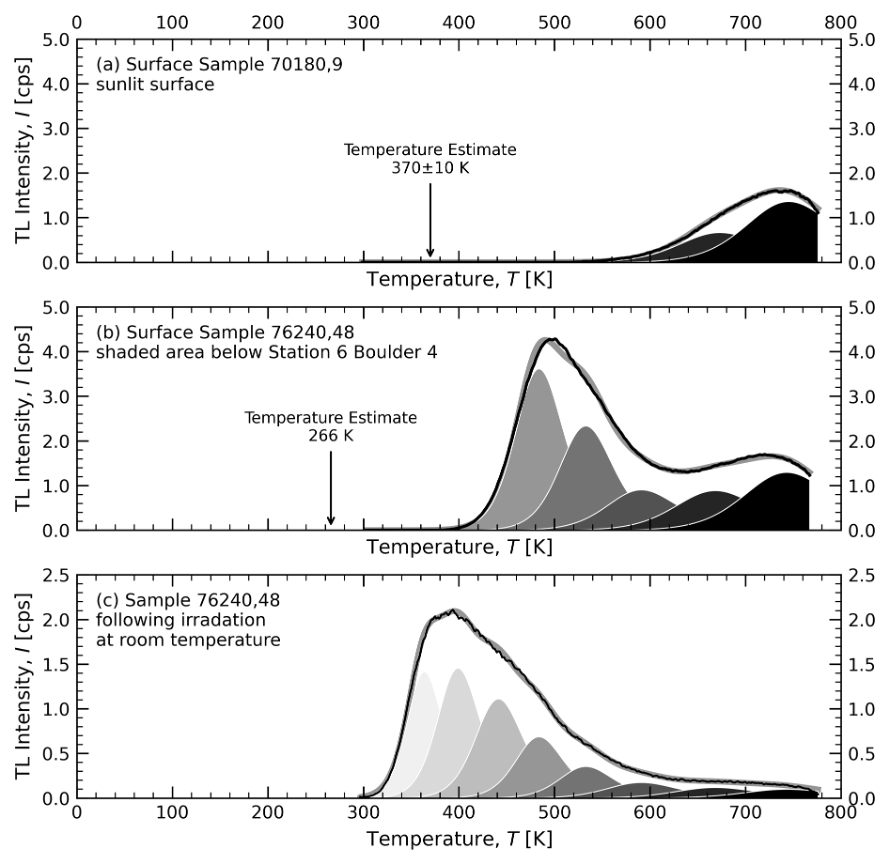

<a href="#installation">Installation</a>

<a href="#tl_def">What is thermoluminescence?</a>

<a href="#usage">Usage</a>

Requirements:

<h1 id = "installation">Installation</h1>

* Python 3.11.9 (or other compatible version)r

Instructions:

1. Install the following packages:
    1. scipy==1.14.0
    2. argparse
    3. cffi==1.16.0
    4. pandas==2.2.2
    5. matplotlib==3.9.0
    6. tqdm==4.66.4
    7. numpy==2.0.0
    8. rich==13.7.0
        1. To do this, paste the following command into the terminal: `pip install scipy==1.14.0 cffi==1.16.0 pandas==2.2.2 matplotlib==3.9.0 tqdm==4.66.4 numpy==2.0.0 rich==13.7.0`
2. The program should now be installed. Read USAGE.md to learn more about how to use it.

<h1 id = "tl_def">Thermoluminescence Definition</h1>

What is thermoluminescence?

* Ionizing radiation excites and traps electrons into higher energy levels (E).
* Heat provides necessary activation energy (Ea) for electrons to fall back to their ground state
* Electron passes through luminescence center
* Excess energy is emitted as light (hv), which is measurable (= glow curve)
* Type of trap trap present and its stability is governed by the electron trap (E, in eV) and the Arrhenius factor (s, in s-1)

What is thermoluminescence? (cont.)

* The light emission from TL can be described with the following equation for each peak, where n0 is the amount of filled traps, N is the number of total traps available, and β is the heating rate.

_TL of lunar mare and highland material investigated through Apollo 17 samples (ANGSA) - Eight discrete TL peaks between 298 – 800 K_

<h1 id = "usage">Usage</h1>

Usage: main.py [-h] [--initial_guess [INITIAL_GUESS ...]] [--basinhopping] [--brute] [--ns NS] [--cppdifferential_evolution] [--differential_evolution]

                   [--strategy STRATEGY] [--popsize POPSIZE] [--tol TOL] [--mutation MUTATION MUTATION] [--recombination RECOMBINATION] [--polish]

                   [--init INIT] [--atol ATOL] [--updating UPDATING] [--vectorized] [--shgo] [--n N] [--iters ITERS] [--sampling_method SAMPLING_METHOD]        

                   [--maxfev MAXFEV] [--f_min F_MIN] [--f_tol F_TOL] [--ftol FTOL] [--maxiter MAXITER] [--maxev MAXEV] [--maxtime MAXTIME] [--minhgrd MINHGRD]  

                   [--no_minimize_every_iter] [--local_iter LOCAL_ITER] [--dual_annealing] [--initial_temp INITIAL_TEMP]

                   [--restart_temp_ratio RESTART_TEMP_RATIO] [--visit VISIT] [--accept ACCEPT] [--no_local_search] [--direct] [--eps EPS] [--maxfun MAXFUN]     

                   [--locally_biased] [--f_min_rtol F_MIN_RTOL] [--vol_tol VOL_TOL] [--len_tol LEN_TOL] --peaks PEAKS --bounds [BOUNDS ...]

                   [--workers WORKERS] [--sigma SIGMA] [--curve_ftol CURVE_FTOL] [--absolute_sigma] [--verbose] [--output OUTPUT] [--beta BETA]

                   filename

* What does this program do?
    * This program deconvolves thermoluminescence data into its component peaks, using SciPy's global and local solvers (and a C++ implementation of Differential Evolution)
* How does it work?
    * The program, depending on the input parameters, runs a Global Solver to deconvolve the data. To do this, the Global Solver is tasked with minimizing a cost function (the residual of the difference between the data and the component peaks). Once it has its initial estimate, it then passes it to the Local Solver, which is a Nonlinear Curve Fitting system.
* Sources
    * Python
        * [SciPy](https://scipy.org/)
        * [argparse](https://docs.python.org/3/library/argparse.html)
        * [CFFI](https://cffi.readthedocs.io/en/stable/)
        * [Pandas](https://pandas.pydata.org/)
        * [Matplotlib](https://matplotlib.org/)
        * [TQDM](https://github.com/tqdm/tqdm)
        * [NumPy](https://numpy.org/)
        * Python Standard Library
    * C++
        * [differential_evolution.h](https://github.com/milsto/differential-evolution)
        * C++ Standard Library
    * Authors
        * Arjun Prem
        * Alex Sehlke
* Required parameters
    * Filename
        * The input data must be provided with **FILENAME.CSV**, where filename.csv is a CSV File containing the input data in the following format(s). **NOTE: The program will accept the .csv file as long it contains temp_c/temp_k and intensity_cps columns.**
            * temp_c,intensity_cps

                23.93257119,47.30296788

                23.92253236,47.8751812

                23.93257119,54.74174105

                ...

            * temp_k,intensity_cps

                1,0.0

                2,0.0

                3,0.0

                ...

    * Bounds (--bounds)
        * The bounds must be provided with **--bounds E_MIN E_MAX S_MIN S_MAX N0_MIN N0_MAX N_min N_max** OR **--bounds BOUNDS.CSV**, where bounds.csv is a CSV file in the following format(s):
            * E_min,E_max,S_min,S_max,n0_min,n0_max,N_min,N_max

                0.8, 0.9, 1.0e+11, 1.0e+12, 1.0e+03, 1.0e+07, 1.0e+05, 1.0e+07

                0.8, 0.9, 1.0e+10, 1.0e+11, 1.0e+03, 1.0e+07, 1.0e+05, 1.0e+07

                

* Number of peaks (--peaks)
    * The number of peaks to fit to the input data must be provided with **--peaks PEAKS**
* Global solver (--initial_guess, --basinhopping, --brute, --differential_evolution - alt. --cppdifferential_evolution, --shgo, --dual_annealing, --direct)
    * The global solver parameter denotes the method used to determine a global minimum to pass to the local curve fit solver.
        * This is required, lest the local curve fit solver gets stuck on a local minimum.
* Global Solvers
    * Initial Guess (--initial_guess)
        * This global solver parameter must be provided with an initial guess for the parameter values, which it directly passes to the Local Solver.
            * When used in conjunction with a solver that supports it (--differential_evolution and --dual_annealing), it serves as an initial guess that the solvers start their search from.
            * This is technically not a Global Solver, but it is a parameter to denote the absence of one.
    * Basin Hopping (--basinhopping)
    * Brute (--brute)
        * Brute force solver that evaluates the cost function at every point in the search space (with a resolution determined by Ns).
            * Implementation used: [brute - SciPy v1.14.0 Manual](https://docs.scipy.org/doc/scipy/reference/generated/scipy.optimize.brute.html#scipy.optimize.brute).
        * Ns (--ns)
            * Ns may be provided with --ns Ns, where Ns determines how many points to divide each axis of the search space into. Defaults to 100.
            * The cost function is evaluated Ns^dimensions, or Ns^(peaks * 4). For a Ns of 100 and 8 peaks, 10^64 function evaluations are required, which is impossible.
    * Differential Evolution (--differential_evolution - alt. --cppdifferential_evolution)
        * Stochastic evolutionary solver that "evolves" to a solution.
            * Implementation used: [differential_evolution - SciPy v1.14.0 Manual](https://docs.scipy.org/doc/scipy/reference/generated/scipy.optimize.differential_evolution.html).
        * Strategy (--strategy)
            * The evolutionary strategy may be provided with --strategy STRATEGY, where STRATEGY is one of the below. Defaults to "best1bin"
                * **best1bin**
                * best1exp
                * rand1bin
                * rand1exp
                * rand2bin
                * rand2exp
                * randtobest1bin
                * randtobest1exp
                * currenttobest1bin
                * currenttobest1exp
                * best2exp
                * best2bin
        * Population Size (--popsize)
            * The population size may be provided with --popsize POPSIZE, where POPSIZE is the population size. The actual population size of the solver is popsize * (N - N_equal), where N is the amount of dimensions (peaks * 4) and N_equal is the amount of equal bounds. Defaults to 15.
        * Tolerance (--tol)
            * The tolerance may be provided with --tolerance TOL, where TOL is the tolerance. The solver stops when the standard deviation of the population's costs is less than or equal to the absolute tolerance plus the tolerance times the mean of the population's costs (std_dev(pop) &lt;= atol + tol * abs(mean(pop))). Defaults to 0.01.
        * Mutation (--mutation)
            * Mutation may be provided as --mutation M1 M2, where (M1, M2) are the differential weights F. M1 and M2 are bounded to [0, 2]. Dithering, randomly changing the mutation constant on a generation by generation basis to speed up convergence, is used. The mutation constant for each generation is taken from is U[M1, M2). Increasing the mutation constant increases the search radius, but slows down convergence. Defaults to (0.5, 1)
        * Recombination (--recombination)
            * Recombination may be provided as --recombination RECOMBINATION, where RECOMBINATION is the recombination constant, otherwise known as the crossover probability (denoted by CR). Bounded to [0, 1]. Increasing this value allows a larger number of mutants to progress into the next generation, but risks population stability. Defaults to 0.7.
        * Polish (--polish)
            * This flag polishes the solver's output to generate a better initial guess. This can take a lot of time, but may be beneficial.
        * Init (--init)
            * The population initialization method may be provided with --init INIT, where INIT is one of the below. Defaults to "latinhypercube"
                * **latinhypercube**
                    * Tries to maximize coverage of the search space.
                * sobol
                    * Better than latinhypercube at maximizing coverage of the search space. Enforces an initial population size that is popsize * (N - N_equal), where N is the amount of dimensions (peaks * 4) and N_equal is the amount of equal bounds.
                * halton
                    * Similiar to sobol, but has no such requirements for the population size.
                * random
                    * Randomly samples throughout the search space. Prone to clustering, preventing the whole search space from being covered.
        * Absolute Tolerance (--atol)
            * Absolute Tolerance may be provided as --atol ATOL, where ATOL is the absolute tolerance. The solver stops when the standard deviation of the population's costs is less than or equal to the absolute tolerance plus the tolerance times the mean of the population's costs (std_dev(pop) &lt;= atol + tol * abs(mean(pop))). Defaults to 0.
        * Update method (--updating)
            * The update method may be provided with --updating METHOD, where METHOD is one of the below. Defaults to "immediate"
                * immediate
                * deferred
            * If "immediate", the best solution vector is continuously updated within a single generation. This can lead to faster convergence as trial vectors can take advantage of continuous improvements in the best solution. With "deferred"', the best solution vector is updated once per generation. "immediate" is incompatible with Vectorization or Parallelization
        * Vectorization (--vectorized)
            * This flag improves single-core speed by passing multiple inputs to the cost function and getting multiple outputs, reducing the Python overhead associated with function calls. Incompatible with Parallelization.
    * C++ Differential Evolution (--cppdifferential_evolution)
        * Stochastic evolutionary solver implemented in C++ that "evolves" to a solution. Dramatically faster than --differential_evolution, but less flexible.
            * Implementation used: [Single header c++ implementation of Differential Evolution algorithm for general purpose optimization.](https://github.com/milsto/differential-evolution)
        * Population Size (--popsize)
            * The population size may be provided with --popsize POPSIZE, where POPSIZE is the population size. The actual population size of the solver is popsize * (N - N_equal), where N is the amount of dimensions (peaks * 4) and N_equal is the amount of equal bounds. Defaults to 15.
        * Tolerance (--tol)
            * The tolerance may be provided with --tolerance TOL, where TOL is the tolerance. The solver stops when the standard deviation of the population's costs is less than or equal to the absolute tolerance plus the tolerance times the mean of the population's costs (std_dev(pop) &lt;= atol + tol * abs(mean(pop))). Defaults to 0.01.
        * Absolute Tolerance (--atol)
            * Absolute Tolerance may be provided as --atol ATOL, where ATOL is the absolute tolerance. The solver stops when the standard deviation of the population's costs is less than or equal to the absolute tolerance plus the tolerance times the mean of the population's costs (std_dev(pop) &lt;= atol + tol * abs(mean(pop))). Defaults to 0.
    * Simplicial Homology Global Optimization (--shgo)
        * Global Solver that uses SHG Optimization to come up with a solution
            * Implementation used: [shgo - SciPy v1.14.0 Manual](https://docs.scipy.org/doc/scipy/reference/generated/scipy.optimize.shgo.html#scipy.optimize.shgo)
        * N (--n)
            * n may be provided as --n N, where N is the number of sampling points used in the construction of the simplicial complex. Defaults to 100.
            * For the default simplicial sampling method 2**dim + 1 sampling points are generated instead of the default n=100. For all other specified values n sampling points are generated. For sobol, halton and other arbitrary sampling_methods n sampling points are generated.
        * Iterations (--iters)
            * The number of iterations may be provided as --iters ITERS, where ITERS is the number of iterations used to construct the simplicial complex. Default is 1.
        * Sampling Method (--sampling_method)
            * The population initialization method may be provided with --sampling_method METHOD, where METHOD is one of the below. Defaults to "simplicial"
                * simplicial
                    * Offers a theoretical guarantee of convergence to the global minimum in finite time. Uses 2**dim + 1 sampling points.
                * sobol
                    * Renenges on this offer in exchange for performance. Uses n sampling points.
                * Halton
                    * Renenges on this offer in exchange for performance. Uses n sampling points.
        * Maximum function evaluations (--maxfev)
            * The maximum function evaluations may be provided with --maxfev MAXFEV, where MAXFEV is the maximum function evaluations. Maximum number of function evaluations in the feasible domain. The solver will stop if this is exceeded. Defaults to unbounded - the solver will run until it finds a solution.
        * Minimum cost function value (--f_min)
            * The minimum cost function value may be provided with --f_min F_MIN, where F_MIN is the minimum cost function value. Defaults to 0. 
            * Maximum number of function evaluations in the feasible domain. The solver will stop if this is exceeded. Defaults to unbounded - the solver will run until it finds a solution.
        * Cost function tolerance (--f_tol)
            * The cost function tolerance may be provided with --f_tol F_TOL, where F_TOL is the tolerance goal for the minimum cost function value. Once reached, the solver stops. Has no default.
        * Cost function local tolerance (--ftol)
            * The cost function local tolerance may be provided with --ftol FTOL, where FTOL is the local tolerance for the local solver SHGO uses. Defaults to 1e-8.
        * Maximum Iterations (--maxiter)
            * The maximum number of iterations may be provided with --maxiters MAXITERS, where MAXITERS is the maximum number of iterations used to construct the simplicial complex. Defaults to unbounded - the solver will run until it finds a solution.
        * Maximum sampling point cost function evaluations (--maxev)
            * The Maximum sampling point cost function evaluations may be provided with --maxev MAXEV, where MAXEV is the maximum sampling point cost function evaluations (includes searching in infeasible points). Defaults to unbounded - the solver will run until it finds a solution.
        * Maximum runtime (--maxtime)
            * The maximum runtime may be provided with --maxtime MAXTIME, where MAXTIME is the maximum processing runtime allowed. Defaults to unbounded - the solver will run until it finds a solution.
        * Minimum homology group rank differential (--minhgrd)
            * The minimum homology group rank differential may be provided as --minhgrd MINHGRD, where MINHGRDis the minimum homology group rank differential. The homology group of the objective function is calculated (approximately) during every iteration. The rank of this group has a one-to-one correspondence with the number of locally convex subdomains in the objective function (after adequate sampling points each of these subdomains contain a unique global minimum). If the difference in the hgr is 0 between iterations for maxhgrd specified iterations the algorithm will terminate.
        * No Minimization Every Iteration (--no_minimize_every_iter)
            * This flag disables local minimization every iteration. Instead, the local minimizer will only be run on the final pool.
        * Local minization Per Iteration (--local_iter)
            * This flag means the solver will only evaluate a few of the best minimizer pool candidates every iteration. Without it, all potential points are passed to the local minimization routine.
    * Dual Annealing (--dual_annealing)
        * Maximum Global SearchIterations (--maxiter)
            * The maximum number of iterations may be provided with --maxiters MAXITERS, where MAXITERS is the maximum number of global search iterations. Defaults to 1000.
        * Initial Temperature (--initial_temp)
            * The initial temperature may be provided with --initial_temp INITTEMP, where INITTEMP is the initial temperature. Higher values facilitate a wider search of the energy landscape, allowing dual_annealing to escape local minima that it is trapped in. Bounded to (0.01, 5.e4]. Defaults to 5230.
        * Restart Temp Ratio(--restart_temp_ratio)
            * The initial temperature may be provided with --restart_temp_ratio TMP, where TMP is the temperature ratio to restart. During the annealing process, temperature is decreasing, when temperature/initial_temperature becomes restart_temp_ratio, the reannealing process is triggered. Defaults to 2e-5.
        * Visiting Distribution (--visit)
            * The visiting distribution may be provided with --visit VISIT, where VISIT is the visiting distribution. Higher values give the visiting distribution a heavier tail, this makes the algorithm jump to a more distant region. Bounded to (1, 3]. Defaults to 2.62.
        * Acceptance Distribution (--accept)
            * The acceptance distribution may be provided with --accept ACCEPT, where ACCEPT is the acceptance distribution. It is used to control the probability of acceptance. The lower the acceptance parameter, the smaller the probability of acceptance. Bounded to (-1e4, -5]. Defaults to -5.
        * Max Cost Function Evaluations (--maxfun)
            * The max cost function evaluations may be provided with --maxfun MAXFUN, where MAXFUN is a soft limit for the number of objective function calls. If the algorithm is in the middle of a local search, this number will be exceeded, the algorithm will stop just after the local search is done. Defaults to 1e7.
        * No Local Search (--no_local_search)
            * This flag disables the local search strategy used by Dual Annealing.
    * DIRECT (--direct)
        * Solver that uses the DIviding RECTangles algorithm (DIRECT), where hyperrectangles are used to represent the search space. The hyperrectangles are divided until a solution is found.
            * Implementation used: [direct - SciPy v1.14.0 Manual](https://docs.scipy.org/doc/scipy/reference/generated/scipy.optimize.direct.html#scipy.optimize.direct)
        * Minimum division threshold (--eps)
            * EPS may be provided with --eps EPS, where EPS is the minimal required difference of the objective function values between the current best hyperrectangle and the next potentially optimal hyperrectangle to be divided. In consequence, eps serves as a tradeoff between local and global search: the smaller, the more local the search becomes. Defaults to 1e-4.
        * Max Cost Function Evaluations (--maxfun)
            * The max cost function evaluations may be provided with --maxfun MAXFUN, where MAXFUN is a limit for the number of cost function calls. Defaults to unbounded - the solver will run until it finds a solution.
        * Maximum Global SearchIterations (--maxiter)
            * The maximum number of iterations may be provided with --maxiters MAXITERS, where MAXITERS is the maximum number of global search iterations. Defaults to 1000.

            DIRECT_L (--locally_biased)

            * This flag has the solver use the locally biased variant of the algorithm known as DIRECT_L, which is faster but may end up stuck on a local minimum.
            * Without this flag, the program uses the original unbiased DIRECT algorithm, which is (theoretically) guaranteed convergence.
        * Minimum cost function value (--f_min)
            * The minimum cost function value may be provided with --f_min F_MIN, where F_MIN is the minimum cost function value. Defaults to 0.
        * Minimum cost function tolerance (--f_min_rtol)
            * The minimum cost function tolerance may be provided with --f_min_rtol F_RMIN, where F_RMIN is the minimum cost function value. The solver stops once the relative error between the current minimum and f_min is less than f_min_rtol Defaults to 0.
        * Volume Tolerance (--vol_tol)
            * The volume tolerance may be provided with --vol_tol V_TOL, where V_TOL is the volume tolerance. Stops the solver once the volume of the hyperrectangle containing the lowest function value is smaller than vol_tol. Bounded to (0, 1). Defaults to 1e-16.
        * Length Tolerance (--len_tol)
            * The length tolerance may be provided with --len_tol L_TOL, where L_TOL is the length tolerance. If --locally_biased is provided, the solver is stopped once half of the normalized maximal side length of the hyperrectangle containing the lowest function value is smaller than len_tol. Otherwise, the solver is stopped once half of the normalized diagonal of the hyperrectangle containing the lowest function value is smaller than len_tol. Bounded to (0, 1). Defaults to 1e-6.
* Local Fit Parameters
    * Local Solver that uses (local) curve-fitting on the global solver's initial guess to generate a more precise result.
        * Implementation used: [curve_fit - SciPy v1.14.0 Manual](https://docs.scipy.org/doc/scipy/reference/generated/scipy.optimize.curve_fit.html#scipy.optimize.curve_fit)
    * Intensity uncertainty (--sigma)
        * The intensity uncertainty may be provided with --sigma SIGMA, where SIGMA is the relative uncertainty of the intensity data. Defaults to 1.
    * Absolute Sigma (--absolute_sigma)
        * This flag has the local solver use --sigma as an absolute uncertainty of the intensity data
    * Curve Fitting Tolerance (--curve_ftol)
        * The curve fitting tolerance may be provided with --curve_ftol C_FTOL, where C_FTOL is the curve fitting tolerance. Lower values mean a better final result but reduce performance (but 1e-8 is a good value if you prioritize precision). Defaults to 0.001.
* Other Parameters
    * Verbose (--verbose)
        * This flag enables verbose output for the solvers, overriding the progress bar --differential_evolution and --cpp_differential_evolution have. It is incompatible with --brute. --direct, --shgo, and --dual_annealing do not display completion percentages (which is why they do not have percentage bars) However, they display the current solution, with --dual_annealing displaying the current cost as well.
    * Output File (--output)
        * The output file may be provided with --output FILE, where FILE is the place to write the output file. If a file exists there, it will be overwritten, and if none exists, a new file will be created.
    * Heating rate (--beta)
        * The heating rate may be provided with --beta RATE, where RATE is the heating rate of the sample in degrees per second. Defaults to 2.0.
    * Parallelization (--workers)
        * The number of threads to use may be provided with --workers WORKERS, where WORKERS defines how many threads to have the solver use. Incompatible with --vectorized, --direct, --dual_annealing, --cppdifferential_evolution, and --initial_guess. Setting this to -1 has the solver use all available threads. Defaults to 1.