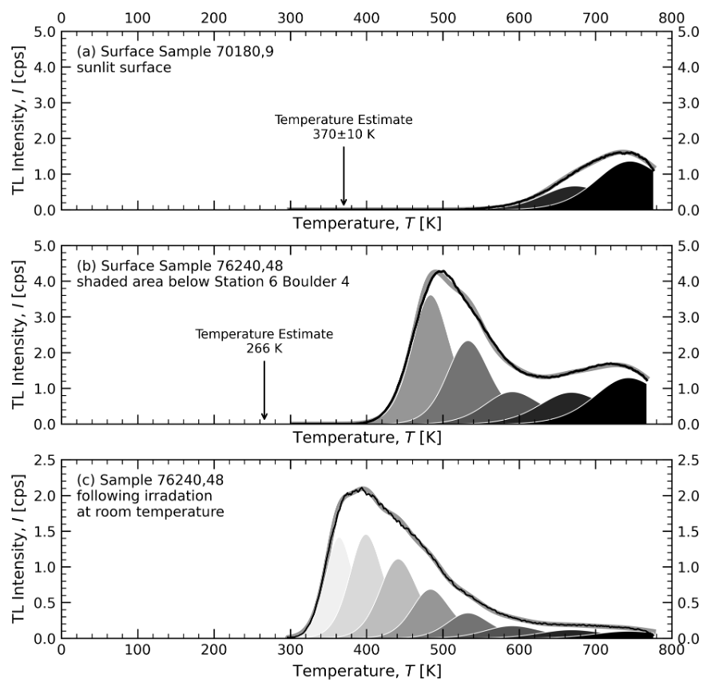
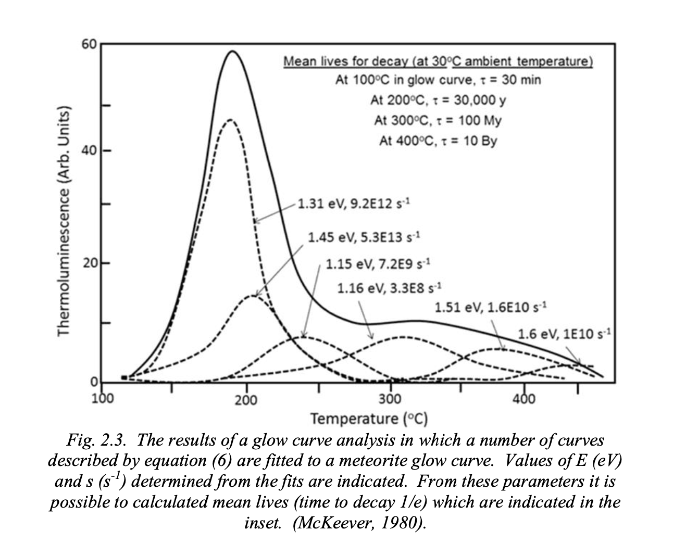
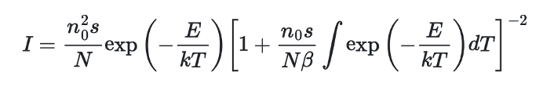
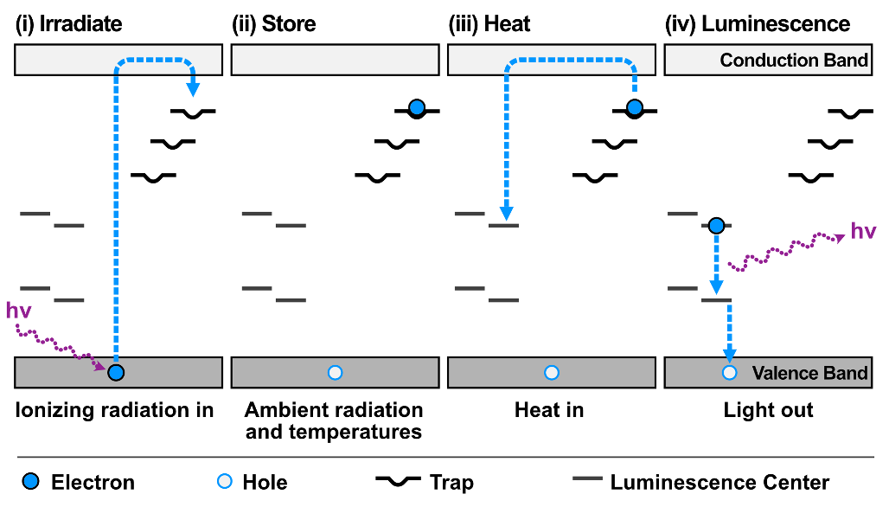

What is thermoluminescence?

* Ionizing radiation excites and traps electrons into higher energy levels (E).
* Heat provides necessary activation energy (Ea) for electrons to fall back to their ground state
* Electron passes through luminescence center
* Excess energy is emitted as light (hv), which is measurable (= glow curve)
* Type of trap trap present and its stability is governed by the electron trap (E, in eV) and the Arrhenius factor (s, in s-1)

What is thermoluminescence? (cont.)

* The light emission from TL can be described with the following equation for each peak, where n0 is the amount of filled traps, N is the number of total traps available, and β is the heating rate.

_TL of lunar mare and highland material investigated through Apollo 17 samples (ANGSA) - Eight discrete TL peaks between 298 – 800 K_

